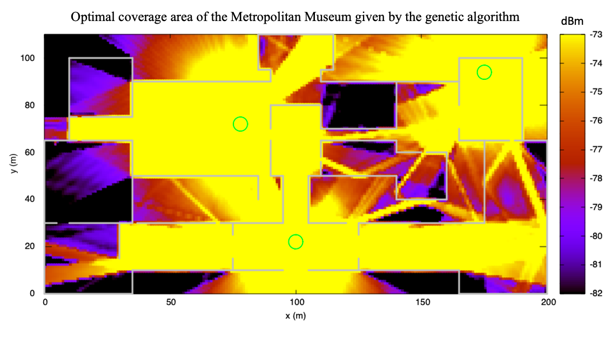

# Introduction

This project focuses on developing a **ray-tracing** software for electromagnetic wave propagation analysis. It calculates the power received by a device from a Wifi access point within a building, determines the 5G indoor small cell base station's coverage area, and assesses the received bit rate based on the receiver's location.

## Assumptions

To streamline the analysis and enhance simulation efficiency, the project relies on several assumptions:
1. **Antenna Assumptions:**
   - 5G network at 27 GHz with lossless half-wavelength dipole antennas oriented along the z-axis.
   - Antenna transmission power is 20 dBm.
   - Transmitters and receivers are at the same height.
   - Analysis focuses on horizontally propagating plane waves.
    
2. **Far-field Approximation:**
   - Applies the far-field approximation throughout the building, valid for distances beyond 2.78 cm from the transmitter, ensuring the receiver is always in the far-field region.
    
3. **Plane Waves:**
   - Assumes locally plane waves, a valid approximation under the far-field condition.
    
4. **Environmental Interactions:**
   - Considers only waves affected by up to three reflections or wall transmissions, excluding diffraction and ignoring internal obstacles like furniture and doors.

# Software

Developed in C++, the software benefits from object-oriented design for ease of modeling and computational efficiency. It offers three operating modes:
- **Mode 1**: Displays rays reaching the receiver, calculating received power. Users set transmitter and receiver positions.
- **Mode 2**: Visualizes coverage area and intensity by map discretization, allowing user-defined transmitter positions and discretization levels.
- **Mode 3**: Uses a genetic algorithm to optimize transmitter number and placement for maximum coverage, detailed in the optimization section.

# Optimization

Aiming for optimal 5G coverage with minimal transmitters, the project employs a genetic algorithm inspired by chromosome replication techniques. This approach avoids exhaustive positioning evaluations and does not pre-determine the number of sources. The methodology is based on the work <a href="https://ieeexplore.ieee.org/document/4812006"/>"Wireless Heterogeneous Transmitter Placement Using Multiobjective Variable-Length Genetic Algorithm" by C. Ting et al.</a>

